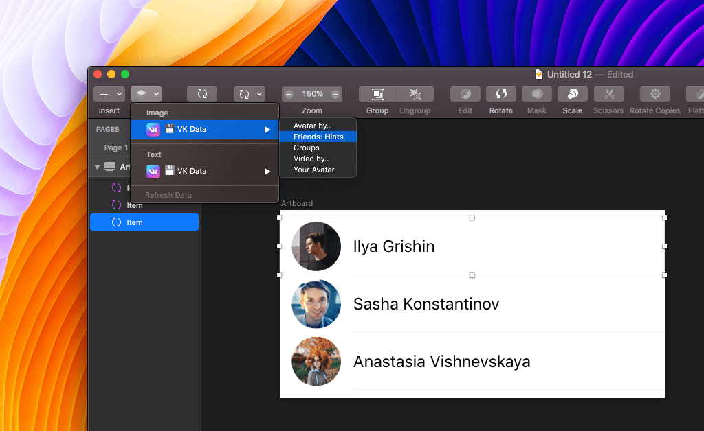

# VK Data Sketch Plugin

## Installation

The plugin comes bundled with Sketch 52, but if for some reason you’ve lost it, you can [download it from the releases page](https://github.com/VKCOM/vkdata-sketchplugin/releases).

## Features

Get Avatars, names and video thumbnails from your account at vk.com, using Sketch 52’s new Data Supplier feature.

You can use it from the toolbar Data icon, from the contextual menu for any layer, or even for Overrides using the Inspector.

