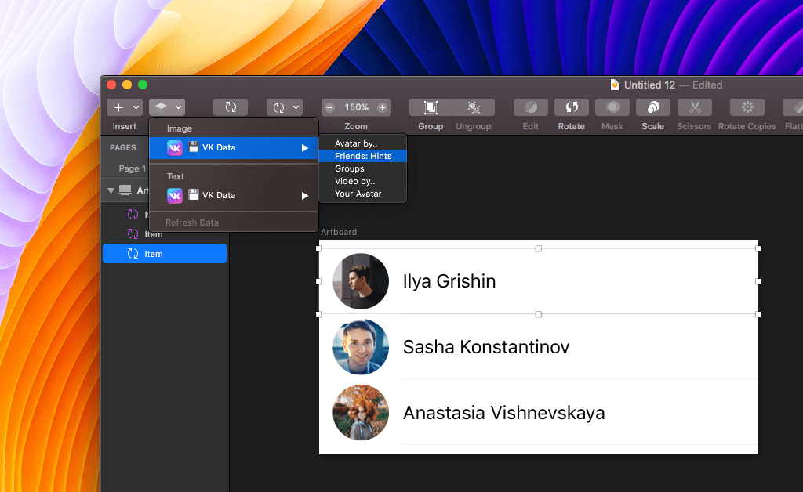
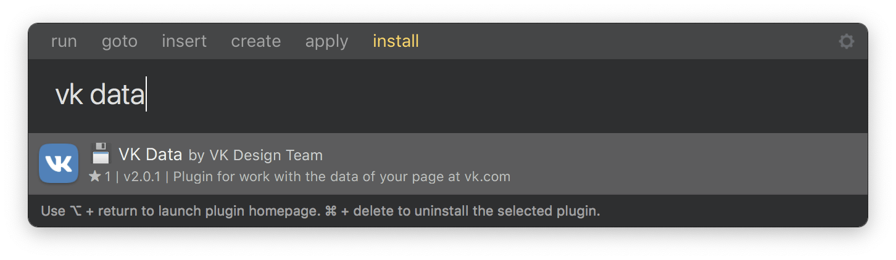

# VK Data Sketch Plugin

## Installation

Just [download it from the releases page](https://github.com/VKCOM/vkdata-sketchplugin/releases).

## Features

Get Avatars, names and video thumbnails from your account at vk.com, using Sketch 52’s new Data Supplier feature.

You can use it from the toolbar Data icon, from the contextual menu for any layer, or even for Overrides using the Inspector.

## Install with Sketch Runner

With Sketch Runner, just go to the `install` command and search for `VK Data`. Runner allows you to manage plugins and do much more to speed up your workflow in Sketch. [Download Runner here](http://www.sketchrunner.com).

